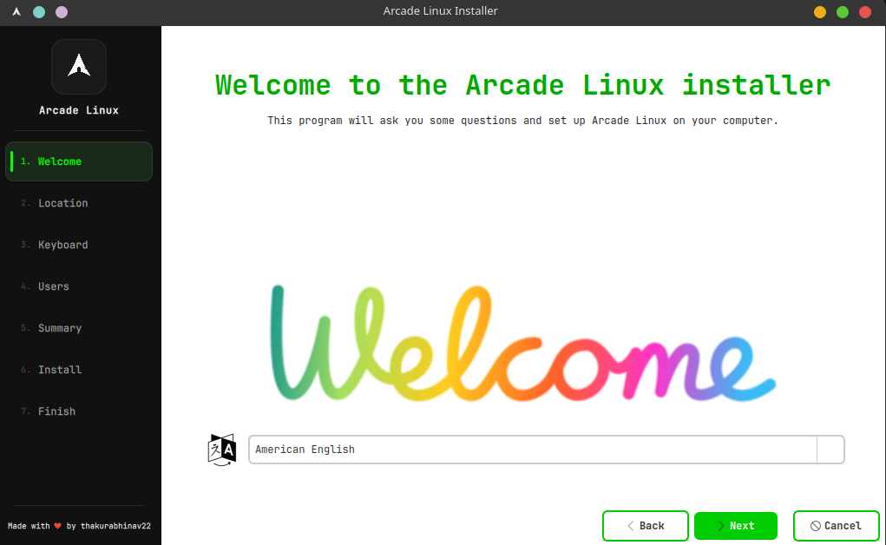
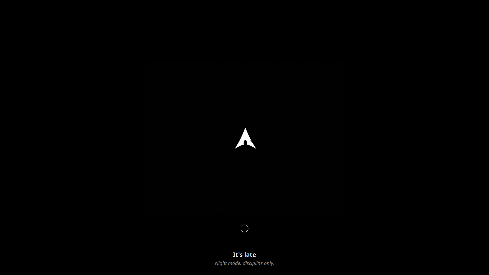
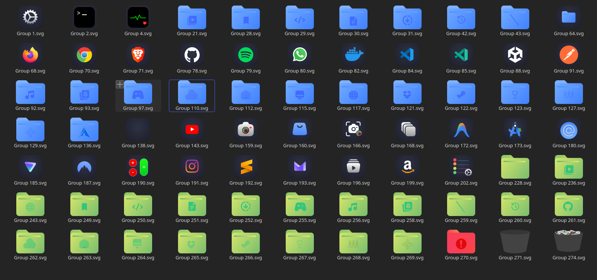

# ArcadeLinux-Core

> Core components for **Arcade Linux** — an Arch-based distro with a macOS-inspired aesthetic, built for low-end hardware (2GB RAM minimum).

---

## Components

### calamares-core

Custom Calamares GUI installer with Arcade Linux branding.

### arcade-splash

KDE Plasma splash screen with animated visuals and time-based dynamic quotes.

### arcade-icons-theme

Custom icon theme designed for consistency across the Arcade Linux desktop.

---

## Credits & Attribution

* Calamares configuration forked from [ArchCraft](https://github.com/archcraft-os/core-packages) by [adi1090x](https://github.com/adi1090x), licensed under GPL-3.0

* Built on [Calamares](https://calamares.io) — the universal installer framework

* Icon theme based on [WhiteSur Icon Theme](https://github.com/vinceliuice/WhiteSur-icon-theme) by  by [vinceliuice](https://github.com/vinceliuice)
  Licensed under GPL-3.0
  Modifications and adaptations made for Arcade Linux


<div align="center">


<p><em>Welcome</em></p>

</div>

---

<div align="center">


<p><em>Splash Preview</em></p>

</div>

---

<div align="center">


<p><em>Arcade Icons (Beta)</em></p>

</div>

---

## Requirements

```bash
sudo pacman -S calamares kpmcore partitionmanager qt5-base qt5-svg qt5-xmlpatterns
```

---

# calamares-core

## Build

```bash
cd calamares-core
makepkg -sf
```

Output:

```
calamares-3.4.2-2-x86_64.pkg.tar.zst
```

---

## Test Locally (without ISO)

```bash
cd calamares-core

makepkg -si

sudo cp -r branding/arcade /usr/share/calamares/branding/
sudo cp settings.conf /usr/share/calamares/settings.conf
sudo cp modules/* /etc/calamares/modules/

sudo calamares -d
```

> "No partitions" and disk warnings are expected outside the live ISO.

---

## Customize Branding

Edit:

```
calamares-core/branding/arcade/branding.desc
```

```yaml
style:
   sidebarBackground:    "#1A1A1A"
   sidebarText:          "#FFFFFF"
   sidebarTextSelect:    "#00FF00"
   sidebarTextHighlight: "#00CC00"
```

Assets:

* `logo.png` (256x256)
* `welcome.png` (600x250)
* `slides/`
* `stylesheet.qss`

---

## Install Sequence

```
Welcome → Location → Keyboard → Partition → Users → Summary → Install → Finish
```

---

# arcade-splash

## Install

```bash
cd arcade-splash

mkdir -p ~/.local/share/plasma/look-and-feel/arcade-splash
cp -r * ~/.local/share/plasma/look-and-feel/arcade-splash/
```

Apply via:

```
System Settings → Splash Screen
```

---

## Features

* Animated splash (GIF-based)
* Time-based greeting
* Context-aware quotes (morning / afternoon / evening / night)
* Lightweight QML for fast boot

---

# arcade-icons-theme

## Install (Development)

```bash
rm -rf ~/.local/share/icons/Arcade-icons

ln -s ~/Desktop/ProjectArcade/ArcadeLinux-Core/Arcade-icons-theme/Arcade-icons \
~/.local/share/icons/Arcade-icons
```

---

## Install (Copy)

```bash
cp -r Arcade-icons-theme/Arcade-icons ~/.local/share/icons/
```

Apply via:

```
System Settings → Icons
```

---

## Sync to Arcade-OS ISO

```bash
# Branding
cp -r calamares-core/branding/arcade \
  ../Arcade-OS/Profile/airootfs/usr/share/calamares/branding/

# Settings
cp calamares-core/settings.conf \
  ../Arcade-OS/Profile/airootfs/etc/calamares/

# Modules
cp calamares-core/modules/* \
  ../Arcade-OS/Profile/airootfs/etc/calamares/modules/

# Package
cp calamares-core/calamares-3.4.2-2-x86_64.pkg.tar.zst \
  ../Arcade-OS/local-repo/

cd ../Arcade-OS/local-repo
repo-add -R arcade-local.db.tar.gz calamares-3.4.2-2-x86_64.pkg.tar.zst
```

---

## Rebuild ISO

```bash
cd ../Arcade-OS/Profile
sudo rm -rf work/
sudo mkarchiso -v -w work/ -o out/ .
```

---

## Known Issues

* Animated GIF not supported in Calamares welcome page
* `bootloader-config` module does not exist in Calamares 3.4.2
* Disk warnings are expected when testing without a real disk

---

## License

GPL-3.0 — Made with ❤️ by [@thakurabhinav22](https://github.com/thakurabhinav22)
